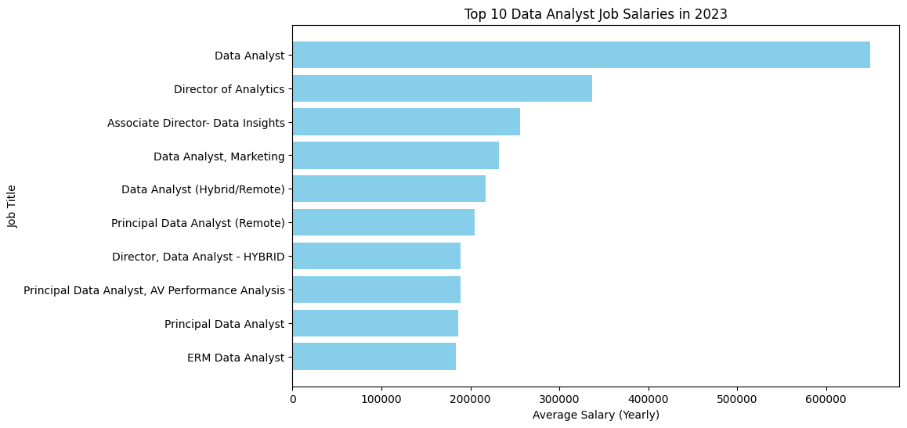

# Overview
Welcome to my analysis of the data job market. This project stems from a need to better understand and navigate the job market.

data source: Luke Barousse (github.com/lukebarousse)

# The Questions
In my project I want to answer following questions:

1. What are the top-paying data analyst jobs?
2. What skills are required for these top-paying jobs?
3. What skills are most in demand for data analysts?
4. Which skills are associated with higher salaries?
5. What are the most optimal skills to learn?

# Tools I Used

For an in-depth analysis of the data analyst job market, I employed several key tools:

- SQL: The core of my analysis, enabling me to query the database and extract vital insights.
- PostgreSQL: The database management system I selected.
- Visual Studio Code: My preferred tool for managing the database and running SQL queries.
- Git & GitHub: Crucial for version control and sharing SQL scripts and analyses, facilitating collaboration and project tracking.
- Python: Libraries like Pandas and Matplotlib allowed me to creat plots.
- Jupyter Notebooks: Used for running Python scripts.

# The Analysis
Every query in this project was designed to explore particular facets of the data analyst job market. 

## 1. Top Paying Data Analyst Jobs

To pinpoint the top-paying roles, I filtered data analyst job listings based on average annual salary and location, with an emphasis on remote positions. This query showcases the opportunities within the field.

```SQL
SELECT	
	job_id,
	job_title,
	job_location,
	job_schedule_type,
	salary_year_avg,
	job_posted_date,
    name AS company_name
FROM
    job_postings_fact
LEFT JOIN company_dim ON job_postings_fact.company_id = company_dim.company_id
WHERE
    job_title_short = 'Data Analyst' AND 
    job_location = 'Anywhere' AND 
    salary_year_avg IS NOT NULL
ORDER BY
    salary_year_avg DESC
LIMIT 10;
```
Overview of the top data analyst positions in 2023:

- **Salary:** The top 10 highest-paying data analyst roles range from $184,000 to $650,000.
- **Employers:** Companies such as SmartAsset, Meta, and AT&T are offering high salaries, demonstrating widespread interest across multiple sectors.
- **Job Titles:** There is a wide variety of job titles, from Data Analyst to Director of Analytics, showcasing the diverse roles and specializations within the field of data analytics.



*Bar graph visualizing the salary for the top 10 salaries for data analysts; I use Python to create visualization*

## 2. Skills for Top Paying Jobs
To determine the skills needed for the highest-paying positions, I combined job postings with skills data, revealing what employers prioritize for well-compensated roles.

``` SQL
WITH top_paying_jobs AS (
    SELECT	
        job_id,
        job_title,
        salary_year_avg,
        name AS company_name
    FROM
        job_postings_fact
    LEFT JOIN company_dim ON job_postings_fact.company_id = company_dim.company_id
    WHERE
        job_title_short = 'Data Analyst' AND 
        job_location = 'Anywhere' AND 
        salary_year_avg IS NOT NULL
    ORDER BY
        salary_year_avg DESC
    LIMIT 10
)

SELECT 
    top_paying_jobs.*,
    skills
FROM top_paying_jobs
INNER JOIN skills_job_dim ON top_paying_jobs.job_id = skills_job_dim.job_id
INNER JOIN skills_dim ON skills_job_dim.skill_id = skills_dim.skill_id
ORDER BY
    salary_year_avg DESC;
```
Overview of the most in-demand skills for the top 10 highest-paying data analyst jobs in 2023:

- **SQL** tops the list.
- **Python** is a close second.
- **Tableau** is also highly valued
- Other skills such as **R**, **Snowflake**, **Pandas**, and **Excel** exhibit varying levels of demand.


*Bar graph visualizing the count of skills for the top 10 paying jobs for data analysts. I use Python to visualize.*

## 3. In-Demand Skills for Data Analysts

This query pinpointed the skills most commonly sought in job postings, highlighting areas with high demand.

```SQL
SELECT 
    skills,
    COUNT(skills_job_dim.job_id) AS demand_count
FROM job_postings_fact
INNER JOIN skills_job_dim ON job_postings_fact.job_id = skills_job_dim.job_id
INNER JOIN skills_dim ON skills_job_dim.skill_id = skills_dim.skill_id
WHERE
    job_title_short = 'Data Analyst' 
    AND job_work_from_home = True 
GROUP BY
    skills
ORDER BY
    demand_count DESC
LIMIT 5;
```
Overview of the most sought-after skills for data analysts in 2023:

- **SQL** and **Excel** continue to be crucial, underscoring the importance of foundational skills in data processing and spreadsheet management.
- **Programming** and **Visualization Tools** such as **Python**, **Tableau**, and **Power BI** are vital, highlighting the growing significance of technical skills in data storytelling and supporting decision-making.

| Skills   | Demand Count |
|----------|--------------|
| SQL      | 7291         |
| Excel    | 4611         |
| Python   | 4330         |
| Tableau  | 3745         |
| Power BI | 2609         |

*Table of the demand for the top 5 skills in data analyst job postings*

## 4. Skills Based on Salary
Investigating the average salaries linked to various skills uncovered which ones command the highest pay.

```SQL
SELECT 
    skills,
    ROUND(AVG(salary_year_avg), 0) AS avg_salary
FROM job_postings_fact
INNER JOIN skills_job_dim ON job_postings_fact.job_id = skills_job_dim.job_id
INNER JOIN skills_dim ON skills_job_dim.skill_id = skills_dim.skill_id
WHERE
    job_title_short = 'Data Analyst'
    AND salary_year_avg IS NOT NULL
    AND job_work_from_home = True 
GROUP BY
    skills
ORDER BY
    avg_salary DESC
LIMIT 25;
```
Overwie of the findings for the highest-paying skills for Data Analysts:

- **High Demand for Big Data & ML Skills**: Analysts proficient in big data technologies (PySpark, Couchbase), machine learning tools (DataRobot, Jupyter), and Python libraries (Pandas, NumPy) earn top salaries, highlighting the industry's high regard for data processing and predictive modeling abilities.
- **Software Development** & **Deployment Proficiency**: Expertise in development and deployment tools (GitLab, Kubernetes, Airflow) suggests a lucrative intersection between data analysis and engineering, with a premium on skills that enhance automation and efficient data pipeline management.
- **Cloud Computing Expertise**: Knowledge of cloud and data engineering tools (Elasticsearch, Databricks, GCP) emphasizes the growing significance of cloud-based analytics environments, indicating that cloud proficiency considerably increases earning potential in data analytics

| Skills        | Average Salary ($) |
|---------------|-------------------:|
| pyspark       |            208,172 |
| bitbucket     |            189,155 |
| couchbase     |            160,515 |
| watson        |            160,515 |
| datarobot     |            155,486 |
| gitlab        |            154,500 |
| swift         |            153,750 |
| jupyter       |            152,777 |
| pandas        |            151,821 |
| elasticsearch |            145,000 |

*Table of the average salary for the top 10 paying skills for data analysts*

## 5. Most Optimal Skills to Learn

By merging insights from demand and salary data, this query sought to identify skills that are both highly sought after and well-compensated, providing a strategic direction for skill development.

```SQL
SELECT 
    skills_dim.skill_id,
    skills_dim.skills,
    COUNT(skills_job_dim.job_id) AS demand_count,
    ROUND(AVG(job_postings_fact.salary_year_avg), 0) AS avg_salary
FROM job_postings_fact
INNER JOIN skills_job_dim ON job_postings_fact.job_id = skills_job_dim.job_id
INNER JOIN skills_dim ON skills_job_dim.skill_id = skills_dim.skill_id
WHERE
    job_title_short = 'Data Analyst'
    AND salary_year_avg IS NOT NULL
    AND job_work_from_home = True 
GROUP BY
    skills_dim.skill_id
HAVING
    COUNT(skills_job_dim.job_id) > 10
ORDER BY
    avg_salary DESC,
    demand_count DESC
LIMIT 25;
```
| Skill ID | Skills     | Demand Count | Average Salary ($) |
|----------|------------|--------------|-------------------:|
| 8        | go         | 27           |            115,320 |
| 234      | confluence | 11           |            114,210 |
| 97       | hadoop     | 22           |            113,193 |
| 80       | snowflake  | 37           |            112,948 |
| 74       | azure      | 34           |            111,225 |
| 77       | bigquery   | 13           |            109,654 |
| 76       | aws        | 32           |            108,317 |
| 4        | java       | 17           |            106,906 |
| 194      | ssis       | 12           |            106,683 |
| 233      | jira       | 20           |            104,918 |

*Table of the most optimal skills for data analyst sorted by salary*

Overwie of the most advantageous skills for Data Analysts in 2023:

- **High-Demand Programming Languages**: **Python** and **R** are notably in high demand, with 236 and 148 job postings respectively. Despite their popularity, their average salaries are around $101,397 for **Python** and $100,499 for **R**, suggesting that while these skills are highly valued, they are also widely possessed.
- **Cloud Tools and Technologies**: Proficiency in specialized technologies like **Snowflake**, **Azure**, **AWS**, and **BigQuery** is in significant demand and commands relatively high average salaries, highlighting the increasing importance of cloud platforms and big data technologies in data analytics.
- **Business Intelligence and Visualization Tools**: Tools such as **Tableau** and **Looker**, with demand counts of 230 and 49 respectively, and average salaries around $99,288 and $103,795, underscore the essential role of data visualization and business intelligence in extracting actionable insights from data.
- **Database Technologies**: The demand for expertise in both traditional and NoSQL databases (**Oracle, SQL Server, NoSQL**) with average salaries ranging from $97,786 to $104,534, indicates the ongoing necessity for skills in data storage, retrieval, and management.

# What I Learned

Throughout this project I had opportunity to combine my SQL skills with Python:

- **Advanced Query Crafting:** merging tables and wusing WITH clauses.
- **Data Aggregationa:** proficiency with GROUP BY, COUNT () and AVG().
- **Analytics:**Enhanced my ability to solve real-world problems.
- **Visualization:** Using Python libraries to plot SQL queries. 


# Insights

1. **Highest-Paying Data Analyst Jobs:** Remote data analyst positions offer a wide salary range, with the top salary reaching $650,000.
2. **Skills for Top-Paying Jobs:** Advanced proficiency in SQL is essential for high-paying data analyst roles.
3. **Most In-Demand Skills:** SQL is the most sought-after skill in the data analyst job market.
4. **Skills with Higher Salaries:** Specialized skills like SVN and Solidity are linked to the highest average salaries, indicating a premium on niche expertise.
5. **Optimal Skills for Job Market Value:** SQL stands out in both demand and salary, making it one of the most valuable skills for data analysts to enhance their market value.
